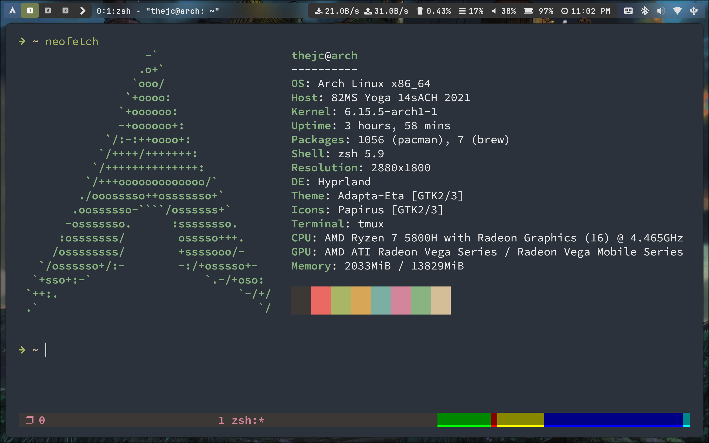

[前置基础安装](https://github.com/threearapig/install)

## 核心部分

* hyprland：窗口管理器
* waybar：顶部状态栏
* rofi：程序起动器
* swww：壁纸管理器
* swaylock：锁屏
* kitty：终端

```bash
paru -S hyprland waybar rofi swww swaylock-effects kitty
```

* tmux：终端复用器
* yazi：终端文件管理器
* lazygit：终端git管理器
* fzf：模糊搜索
* neovim：编辑器
* zsh：shell

```bash
paru -S tmux yazi lazygit fzf zsh neovim
```

```bash
chsh -s /usr/bin/zsh
```

> 安装完zsh之后，更改使用的shell为zsh

```bash
brew install rainbarf
```

> 通过 [Homebrew](https://brew.sh/) 安装rainbarf，在tmux状态栏显示内存资源使用情况


```bash
# 壁纸
git clone https://github.com/threearapig/.wallpapers
```

## 硬件驱动管理

### 声音 + 蓝牙

```bash
paru -S alsa-utils alsa-firmware sof-firmware alsa-ucm-conf pulseaudio pulseaudio-alsa bluez bluez-utils pulseaudio-bluetooth
```

```bash
sudo systemctl enable --now bluetooth
```


### 屏幕背光

```bash
paru -S brightnessctl
```


### 显卡驱动

AMD 核显：  

```bash
paru -S mesa mesa-utils lib32-mesa xf86-video-amdgpu vulkan-radeon lib32-vulkan-radeon vulkan-icd-loader lib32-vulkan-icd-loader libva-mesa-driver lib32-libva-mesa-driver mesa-vdpau lib32-mesa-vdpau
```


## 基本

### Hyprland 必须

```bash
# A notification daemon
paru -S dunst
# Pipewire
paru -S pipewire wireplumber
# XDG Desktop Portal 
paru -S xdg-desktop-portal-hyprland
# Authentication Agent 
paru -S hyprpolkitagent
# Qt Wayland Support
paru -S qt5-wayland qt6-wayland
```


### 截图

```bash
## hyprshot 命令行启动截图
## hyprshot-gui-git 图形化启动截图（功能更多）
paru -S grim slurp hyprshot hyprshot-gui-git
```


### 剪切板

剪切板 + 剪切板管理

```bash
# 剪切板 + 剪切板管理
paru -S wl-clipboard wl-clip-persist-git cliphist
```


### 字体

`dotfiles` 中包含以下字体：  

* `JetBrainsMono`
* `SourceCodePro`


```bash
paru -S noto-fonts-cjk noto-fonts-emoji noto-fonts-extra
```
> 安装谷歌开源字体及表情


```bash
paru -S adobe-source-han-serif-cn-fonts wqy-zenhei
```
> 安装几个开源中文字体 一般装上文泉驿就能解决大多wine应用中文方块的问题


### 输入法

```bash
paru -S fcitx5-im fcitx5-chinese-addons fcitx5-pinyin-zhwiki fcitx5-nord
```

编辑文件：`/etc/environment` 
添加以下内容：  

```environment
QT_IM_MODULE=fcitx
XMODIFIERS=@im=fcitx
SDL_IM_MODULE=fcitx
GLFW_IM_MODULE=ibus
```


### 主题

```bash
paru -S kvantum                    # qt 设置编辑器
paru -S nwg-look                   # gtk 设置编辑器
paru -S adapta-gtk-theme           # adapta 主题
paru -S papirus-icon-theme         # papirus 图标主题
```


### 创建工作目录

```bash
mkdir ~/Desktop
mkdir ~/Documents
mkdir ~/Downloads
mkdir ~/Music
mkdir ~/Pictures
mkdir ~/Public
mkdir ~/Templates
mkdir ~/Videos
mkdir ~/GitHub
mkdir ~/Notes
```

## 常用应用

```bash
paru -S wine wine-mono wine_gecko wine-staging giflib lib32-giflib libpng lib32-libpng libldap lib32-libldap gnutls lib32-gnutls \
mpg123 lib32-mpg123 openal lib32-openal v4l-utils lib32-v4l-utils libpulse lib32-libpulse libgpg-error \
lib32-libgpg-error alsa-plugins lib32-alsa-plugins alsa-lib lib32-alsa-lib libjpeg-turbo lib32-libjpeg-turbo \
sqlite lib32-sqlite libxcomposite lib32-libxcomposite libxinerama lib32-libgcrypt libgcrypt lib32-libxinerama \
ncurses lib32-ncurses opencl-icd-loader lib32-opencl-icd-loader libxslt lib32-libxslt libva lib32-libva gtk3 \
lib32-gtk3 gst-plugins-base-libs lib32-gst-plugins-base-libs vulkan-icd-loader lib32-vulkan-icd-loader
```

```bash
paru -S google-chrome                                                         # 浏览器
paru -S linuxqq wechat telegram-desktop                                       # 社交
paru -S network-manager-applet pasystray-wayland blueberry-wayland udiskie    # 系统托盘软件

paru -S htop                      # 系统资源管理
paru -S mpv vlc                   # 视频播放器
paru -S nautilus                  # 图形化文件管理
paru -S neofetch                  # 系统信息
paru -S net-tools                 # 网络工具集
paru -S unzip unrar               # 解压工具
paru -S man man-pages             # man 手册

paru -S okular             	      # PDF 阅读器
paru -S eusoft-eudic-bin          # 欧路词典
paru -S typora                    # markdown
```


## 其他事项

### grub 美化

grub 在系统安装部分就已经安装过了，现在这部分只是将 grub 美化一下  

通过 [grub2-themes](grubhttps://github.com/vinceliuice/grub2-themes) 来美化，根据官方安装步骤安装即可  


### 双系统时间

如果使用双系统方案：windows + linux  
由于两个系统的默认同步BIOS时钟方式不同，导致时间冲突  
> linux 使用 UTC  
> windows 使用 RTC  

解决方法是将 linux 的同步时间方式改为 rtc  

```bash
sudo timedatectl set-local-rtc 1
```
